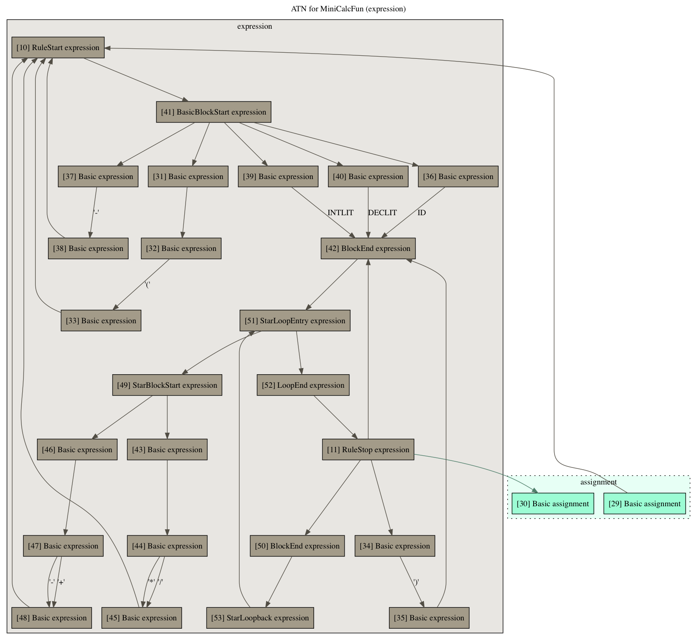

# ANTLR_graph

Generate graphs for ANTLR grammars.

You can run the program specifying the ANTLR grammar files to consider. It will generate DOT files that can be transformed
in images using graphviz.

It generate different files for the whole grammar:

For single rules:

Or for single rules inclusing all related states:

